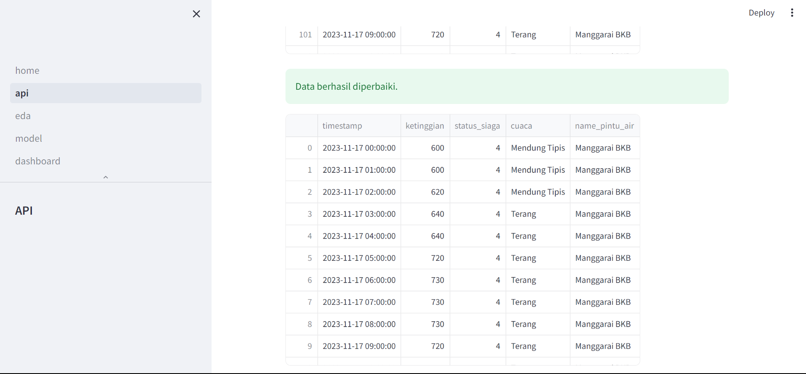
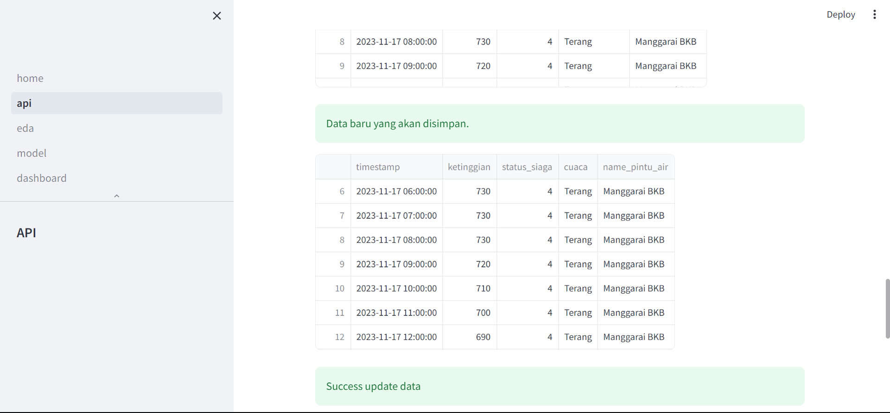

# Sistem Informasi Peringatan Dini Banjir

## Halaman API (Pengumpulan Data)
Pada Halaman ini web service dapat melakukan scrapping data yang bersumber dari website https://pantaubanjir.jakarta.go.id/. Proses pengumpulan data sudah dilakukan secara otomatis dengan melakukan schedulling, setiap 6 jam sekali maka web service akan rutin mengambil data dari sumber. Selain menggunakan schedulling pengambilan data dapat dilakukan dengan cara mengklik button update data. Pada Halaman ini data yang sudah dikumpulkan akan disimpan kedalam spreadsheet. Pada halaman ini juga kita dapat melihat data yang sudah terkumpul pada spreadsheet. spreadsheet disini dijadikan sebagai wadah atau database untuk pemrosesan dan pemodelan agar dapat dilakukan secara realtime.

## Halaman EDA (Eksplorasi dan Pemrosesan Data)

## Halaman Model (Pemodelan LSTM)

## Halaman Dashboard
